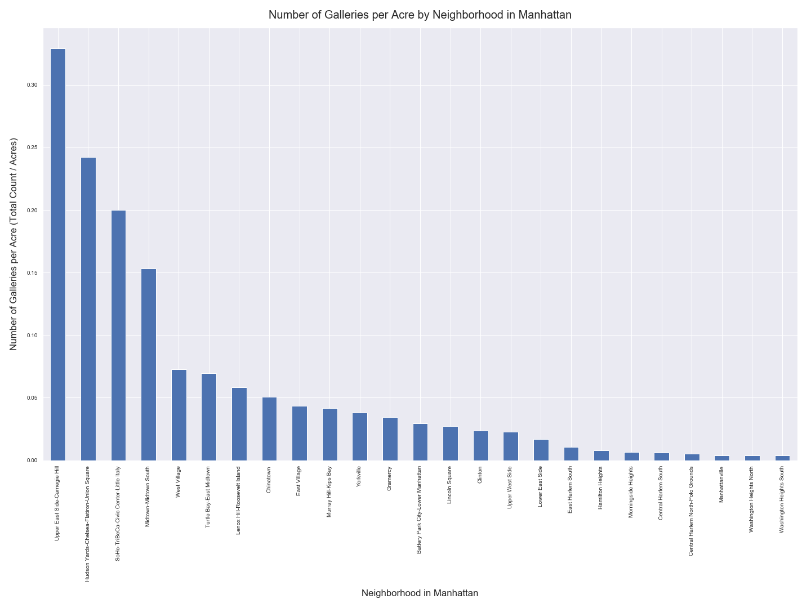
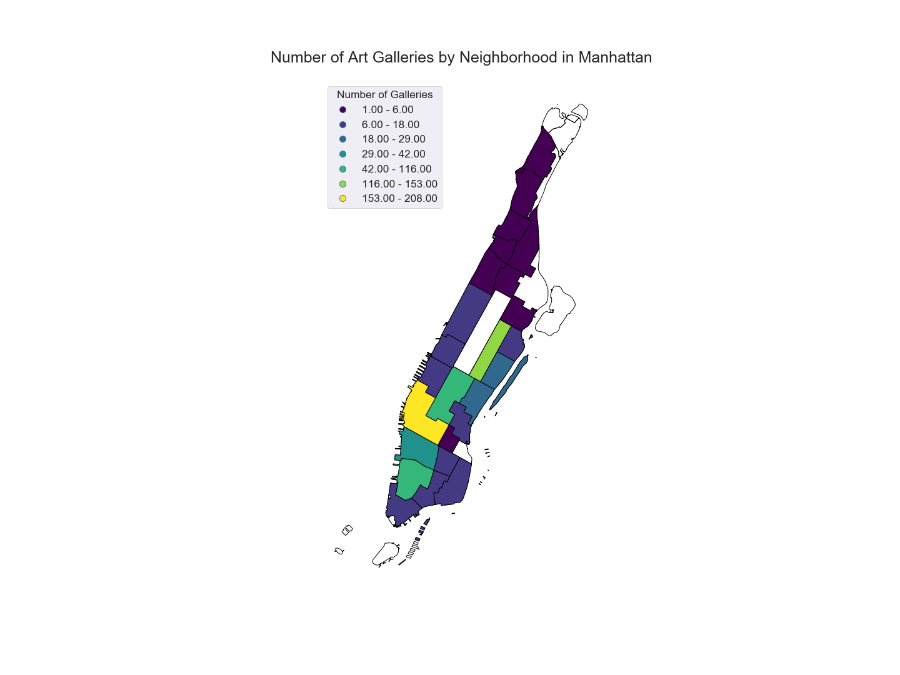
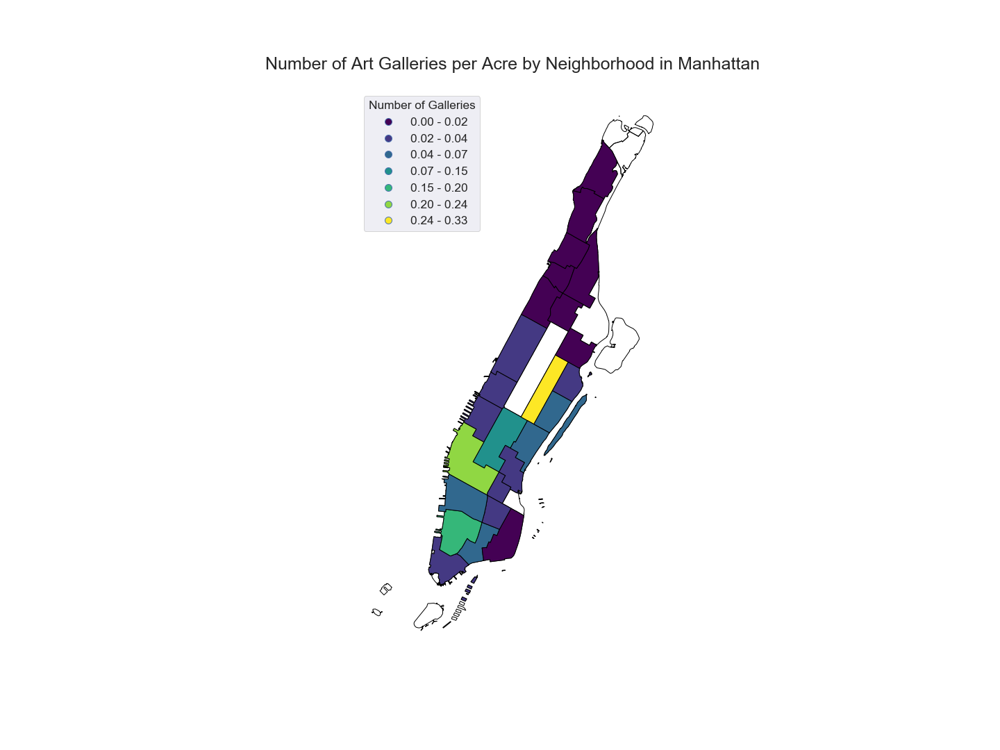

# Analyzing Art Galleries in Manhattan

### Author: Mark Bauer
### Date: December 7, 2019

## Results

### Figure 1. Number of Galleries by Neighborhood in Manhattan

### Figure 2. Number of Galleries per Acre by Neighborhood in Manhattan

### Figure 3. Map of Number of Galleries by Neighborhood in Manhattan

### Figure 4. Map of Number of Galleries per Acre by Neighborhood in Manhattan

### Figure 5. Maps of Count of Number of Galleries and per Acre by Neighborhood in Manhattan
