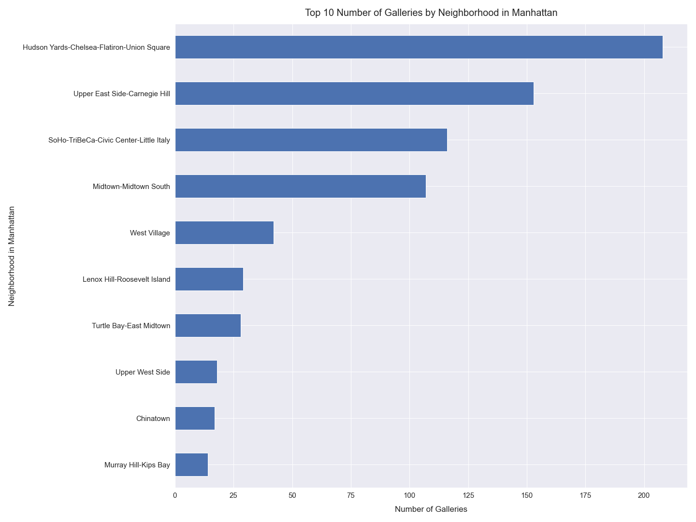

# Exploring Art Galleries in Manhattan using Python

*Author: Mark Bauer*

*Date Created: December 7, 2019*

*Date Modified: December 16, 2019*

# Introduction 

This is my first ever open source project using New York City's Open Data Portal. I have chosen to work with the **Art Galleries in NYC** dataset after seeing the amazing **Yayoi Kusama** exhibition at David Zwirner in Chelsea, New York (yes, I waited two hours for the Infinity Room). I was also inspired by **Art Basel Miami Beach 2019**, which I am still upset I did not attend. Maybe next year?

Besides feeling inspired by art, I will focus on guiding people through the NYC Open Data Portal and display how to perform an exploratory data analysis (EDA) project using the Python programming language. I will also create maps and visualizations solely with Python. 

***Why only Manhattan?*** I originally analyzed all five boroughs, but Manhattan had an overwhelming number of galleries. Thus, for simplicity, this analysis only focuses on neighborhoods in Manhattan.

I am new to the open source community, so feedback is very welcome! Thank you for taking the time to read my notebook.

# Results

**Figure 1. Map of Number of Galleries by Neighborhood in Manhattan**

**Figure 2. Map of Number of Galleries per Acre by Neighborhood in Manhattan**

**Figure 3. Maps of Count of Number of Galleries and per Acre by Neighborhood in Manhattan**

**Figure 4. Number of Galleries by Neighborhood in Manhattan**

**Figure 5. Top 10 Neighborhoods by Number of Galleries in Manhattan**

**Figure 6. Number of Galleries per Acre by Neighborhood in Manhattan**

**Figure 7. Top 10 Neighborhoods by Number of Galleries per Acre in Manhattan**