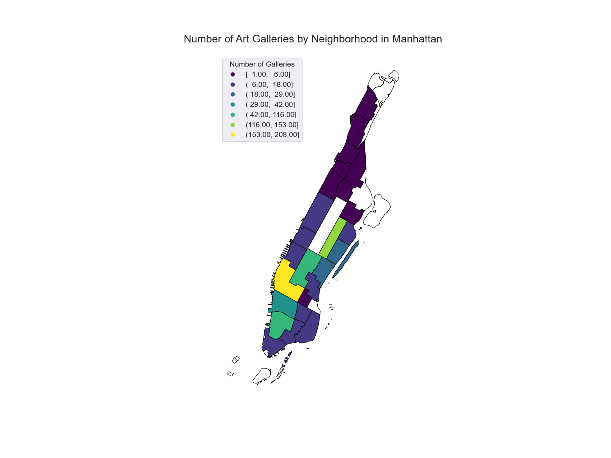

# Analyzing Art Galleries in Manhattan

### Author: Mark Bauer
### Date: December 7, 2019

# Results

## Figure 1. Number of Galleries by Neighborhood in Manhattan

## Figure 2. Top 10 Neighborhoods by Number of Galleries in Manhattan

## Figure 3. Number of Galleries per Acre by Neighborhood in Manhattan

## Figure 4. Top 10 Neighborhoods by Number of Galleries per Acre in Manhattan

## Figure 5. Map of Number of Galleries by Neighborhood in Manhattan

## Figure 6. Map of Number of Galleries per Acre by Neighborhood in Manhattan

## Figure 7. Maps of Count of Number of Galleries and per Acre by Neighborhood in Manhattan
